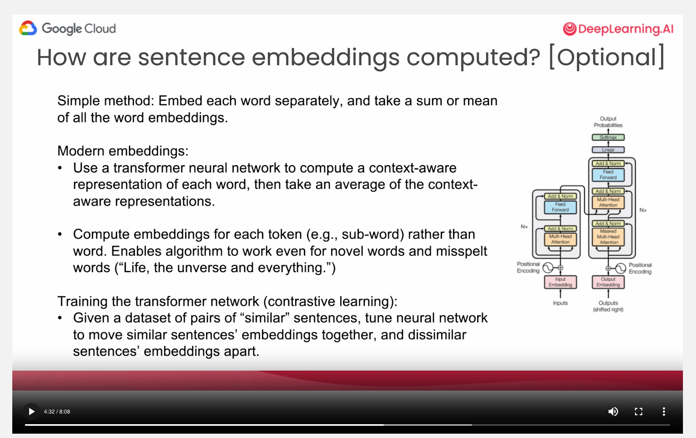

# Understanding Embeddings

Embedding is a way of representing data as point in space where the locations are semantically (the meaning of the piece of text) meaningful.

## How are they computed?

### Simple method
Embed each word separately and take a sum or mean of all the word embeddings.

### Mordern Methods

We instead can use a transformer neural network to compute a context-aware representation of each word. And then, we can take an average of the context-aware embeddings. 

What a transformer neural network does is, very loosely, it takes each word and then computes an embedding for that word. Also, takes into account what other words appear in the sentence. So that's why, taking an example from our previous lesson, the word play, "is it kids playing" or "is it a play in the sense of a show" ? 

Those two words play will end up with different representations, with different vector embeddings because they have different meanings, which the transformer network can figure out by looking at the context of the surrounding words. But by doing this, you get a much more sophisticated embedding. 

But by using this approach, you get an embedding of a sentence that takes into account much more of the meaning of each word, because the word play can mean different things in different contexts. 

And then, there's one other modification to this idea, which makes it even more powerful, which is instead of using a predefined list of words, modern embeddings will compute embeddings for each token, and tokens will often correspond to subwords. And the nice thing about that is it enables the algorithm to work even for novel words and even for misspelled words. So, if I were to write the "unverse", misspelled universe and everything, just title of one of my favorite novels. It will still compute an embedding for this life, the "unverse" and everything that will be, you know, pretty okay, even though I misspelled universe. 

Whereas in contrast, if you're using a traditional embedding technique, then the misspelled "unverse" won't get mapped to an embedding anywhere close to the word universe. And modern large language models take sentences and break them down into subwords called tokens and by learning embeddings for tokens, you can throw any string at it, and it will still, you know, generate some hopefully meaningful embedding. So, this is how embeddings are computed. 

### How are embeddings learned? 

So, the technique used to train the transformer neural networks parameters is a technique called contrastive learning. 

Different research groups are still experimenting with different techniques for computing embeddings. But loosely, you would first pre-train the transformer network on a lot of text data. So, this is how large language models are trained. 

Train it on a lot of unlabeled text data off the internet or off other sources. And then, you would find a data set of pairs of, quote, similar sentences, and then tune the neural network to move the embeddings of more similar sentences together and move dissimilar sentences' embeddings apart. 

#### So, how do you know if two sentences are similar or dissimilar?

Similar sentences can be whatever you define. But, if you have a way of finding a database of similar sentences, and there are a few of these online, that could be one way. Or if your goal is to build a question answering system, you can also declare that a question and its corresponding answer are similar. 

And that will tend to cause the neural network to push the answer to a question closer to the answer embedding of that question. And decimal sentences are often just randomly sampled pairs of sentences because, you know, if you randomly pick two sentences, probably they're not that similar to each other in meaning. 

But today, researchers are still playing around with different variations on this basic recipe, which is why embedding algorithms are still getting better every few months. And it's all an exciting space for research, but they do work well enough for us to just use them right now. 

And in particular, later in this short course, Nikita will go through how to use text embeddings in a range of applications, including text classification, clustering, outline detection, and semantic search. 

And then, we won't talk about product recommendations much in this short course. We can also imagine if you bought products X, Y, and Z, then by using embeddings to find what are similar products based on the product description to stuff that you like. This is also very useful for finding product recommendations. 

### Multi-Modal Embeddings

I just want to share one other fun thing with you, which is multimodal embeddings. 

We won't really cover this in depth in this short course again, but closer to the cutting edge of embeddings is embeddings that can embed both text as well as pictures into the same, say 768 dimensional space. 

So, we've talked about how you can take a piece of text and map that to a 768-dimensional. It turns out that there are multi-modal algorithms, and the term multi-modal refers to that it can process either text or pictures, so data of multi-different modalities, and researchers are working on audio as well, but if a piece of text, oranges are in season, are embedded to a point like that, there are algorithms that can also take a picture of a bunch of oranges, and hopefully embed that picture of the oranges in the location and space that is close to text about oranges. 

And so with these multi-modal embeddings, you can embed text and pictures into the same space, are another exciting development that is slowly opening up even more applications that you can build that understand both text and pictures. 

